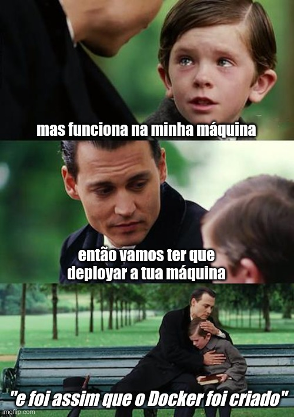

# Docker

Docker está em todas as rodas— backend, frontend, infraestrutura, devops, pesquisa academica, todo mundo quer um pouco desse mel.

O principal benefício em usar o Docker traz o interesse de todo mundo: ter um **ambiente isolado e consistente** para rodar programas de forma homogenea nos mais diversos sistemas. Sabe a piada de que "na minha máquina funciona"? É algo tão recorrente que escolheu-se dar risada para não chorar, não é um problema fácil de se resolver.

Desenvolvedores tentam instalar as mesmas versões da bibliotecas, instalar os mesmos programas, mas nem sempre o sistema da empresa roda tranquilo.
Mas por que?
Essa é a questão de 1 milhão de reais, podem haver vários motivos.
Você instalou um jogo ontem que está usando as mesmas portas, as permissões dos arquivos no disco estão bagunçadas, o `package-lock.json` na sua máquina ficou diferente e você não entende o porque, etc.
Não é incomum o seguinte cenário em pequenas e médias empresas:
> O desenvolvedor líder criou uma solução incrível(mente ruim) com 1001 sistemas de cache e mensageria e agora você, o :clown:, tem que instalar tudo isso na mão baseada na pífia documentação provida e tentar entender como configurar o ambiente.
Quando chega esse abacaxi no teu colo, você quer dar um pulo no [7º circulo do inferno de Dante](https://danteworlds.laits.utexas.edu/circle7.html) e cometer qualquer violência no primeiro cidadão que apareça na frente.
Começa a planejar quais artes você vai vender na praia.

Mas espera lá, ainda há salvação— e nós temos um meme!



Começando em 2013 e adquirindo cada vez mais adeptos, o Docker foi criado com base em funcionalidades do kernel Linux para conseguir criar um sistema isolado, mas ainda muito performático.
Agora, com o Docker, o desenvolvedor pode criar uma **receita de bolo** de um sistema, que instale as bibliotecas e serviços necessários automaticamente, e que qualquer outro desenvolvedor possa executar em suas máquinas.

No Docker, o novo sistema é executado dentro de um **container**, que significa esse isolamento entre o sistema do seu computador (**host**, hospedeiro) e o novo sistema (**guest**, hóspede).
O container tem o seu próprio sistema de arquivos, interface de rede, e lista de processos.
Por estar dentro do **host**, os processadores e memória disponíveis são limitados ao que a máquina possui.

## Rodando containers

Um novo container é criado com o comando:
```bash
docker run <parametros> <imagem> <comando>
```

Esse comando irá criar um container com o sistema disponível dentro de uma `<imagem>` (como um .ISO), e caso seja especificado, rodará o `<comando>` dentro do container.
Quando (e se) o comando finalizar, o container será encerrado.

Vamos rodar o comando `sleep` usando a imagem do Ubuntu:
```bash
docker run ubuntu sleep 2 
```
O que o comando `sleep` faz é esperar por N segundos (aqui, N=2), e encerrar.
Vamos ver o que aconteceu:

Podemos usar o comando `docker ps -a` para listar os containers, usando `-a` para mostrar inclusive os que já foram finalizados.
```bash
docker ps -a
```

O output será algo parecido com isso:
```
CONTAINER ID   IMAGE    COMMAND     CREATED         STATUS                     PORTS   NAMES
125ed240be13   ubuntu   "sleep 2"   4 seconds ago   Exited (0) 2 seconds ago           condescending_banana
```

O container possui um ID, que é gerado aleatoriamente, e também um nome.
O nome dado ao container pode ser especificado como parametro do comando `docker run`, mas caso não seja especificado, o Docker irá atribuir um nome aleatório.
A lista mostra algumas informações que já sabemos, como a imagem e o comando rodado, como também há quanto tempo o container foi criado e o seu status atual.
Nesse caso, o container foi encerrado com código zero (indicando que foi finalizado sem erros) há dois segundos.
Logo, se o container foi criado há dois segundos e criado há quatro segundos, o container teve uma vida de dois segundos, o que é esperado dado que informamos dois segundos para o comando `sleep`.

O comando `docker ps` pode também ser usado para listar containers específicos, por exemplo que estejam usando uma imagem específica:
```bash
docker ps -a --filter="ancestor=ubuntu"
```
(o filtro se chama `ancestor` por conta de uma característica do Docker, que veremos posteriormente)

Com isso, o comando `docker ps` se torna um método fácil de controle de containers, podendo passar os IDs dos containers filtrados para outros comandos.

### Usando diretórios do host

Quando possuímos grande quantidade de dados na maquina e não queremos copiar-los para dentro do container, ou quisermos que alguma pasta do container tenha o mesmo conteúdo que uma pasta do host, podemos usar a funcionalidade chamada _bind mounts_.
O que essa funcionalidade faz é a ligação entre um diretório do host e um diretório do container. Por exemplo:
```bash
docker run -v /mnt/dados:/data ubuntu ls /data
```
irá tornar os arquivos contidos no diretório `/mnt/dados` disponíveis para uso dentro do container, no diretório `/data`.
Nesse exemplo, como estamos listando o conteúdo do diretório `/data`, o comando `ls` irá mostrar os mesmos arquivos da diretório `/mnt/dados`.

### Expondo portas

Por conta dos containers do Docker possuírem sua própria rede, ao rodar um servidor no container, não temos o acesso normal via `localhost`.
Para podermos acessar o servidor rodando dentro do container, usamos a exposição de portas para o host.
Vamos para um exemplo:
```bash
docker run -p 8888:80 nginx
```
Nesse comando, estamos rodando o servidor HTTP **nginx**, usado por muitas plataformas como a interface entre o browser e os serviços da plataforma.
Por padrão, o nginx roda na porta 80, que é acordado como a porta padrão para comunicação HTTP.
Entretanto, portas menores que 1024 são reservadas para uso de serviços específicos, requerindo autorização de administrador para usá-las.
No container do nginx, o usuário possui capacidade de administrador.
Já no host, é possível que o usuário não tenha as capacidades de administrador.

O que fizemos nesse caso é atrelar a porta 80 do nginx, que está sendo executado dentro do container, com a porta 8888 do host.
Assim, quando você acessar `http://localhost:8888` no seu browser, o Docker irá identificar essa conexão e encaminhará ela para a porta 80 dentro do container, chegando no nginx.
Se tudo deu certo, o browser mostrará a pagina padrão de boas-vindas do nginx.

> <imagem do link de portas>

> :warning: É importante notar que outros computadores na mesma rede que a sua podem acessar as portas expostas pelo Docker.
> Para evitar a exposição, você pode especificar para o Docker expor somente para a interface de loopback, mantendo assim somente acessível usando `localhost`: `-p 127.0.0.1:8888:80`
> Regras de firewalls como UFW não são considerados pelo Docker, já que ele possui roteamento próprio.

## Criando seus próprios sistemas containerizados: Imagens

Tudo isso é muito interessante, mas quero rodar o meu próprio software usando Docker, como faço?
Primeiramente devemos entender do que são feitos as imagens.
Ao ser iniciado, o Docker busca a imagem do sistema informado e, caso a imagem nao exista na maquina host, ele baixara a imagem de um registro de imagems (por default, o dockerhub.com).
Por ser auto-contida, a imagem possui tudo o que eh necessario para rodar o software dela, sem haver influencia do que voce possui instalado em sua maquina.

### Somos como cebolas

~~O Docker usa uma forma engenhosa de armazenar a imagem de um sistema: os arquivos fazem parte de pétalas de uma cebola, que a cada nova modificacao feita na imagem, ele cria uma nova camadas que representa essa modificacao.~~ *rewrite*
Voce pode tentar visualizar isso como um projeto versionado com Git, novas modificacoes criam commits, e a sequencia de commits no projeto tracam a vida do projeto, da incipiencia ao estado atual do projeto.

### Uma receita de bolo: Dockerfile

As imagens sao construidas usando uma receita, um passo-a-passo que o Docker pode usar para construir 

### Imagem base (FROM)
### Copiando arquivos (ADD/COPY)
### Diretório atual (WORKDIR)
### Rodando comandos (RUN)
### Variaveis de ambiente (ENV)
### Argumentos (ARG)
### Comando padrão (CMD) e ponto de entrada (ENTRYPOINT)
### Multiplos estagios

## Por baixo dos panos

Dentro do container, o processo `init` eh rodado, realizando o boot do sistema da imagem.
O processo init cuida dos processos posteriores, evitando processos zumbis, como tambem cuida de sinais enviados para o container (ex. o sinal _kill_, para encerrar o container).
